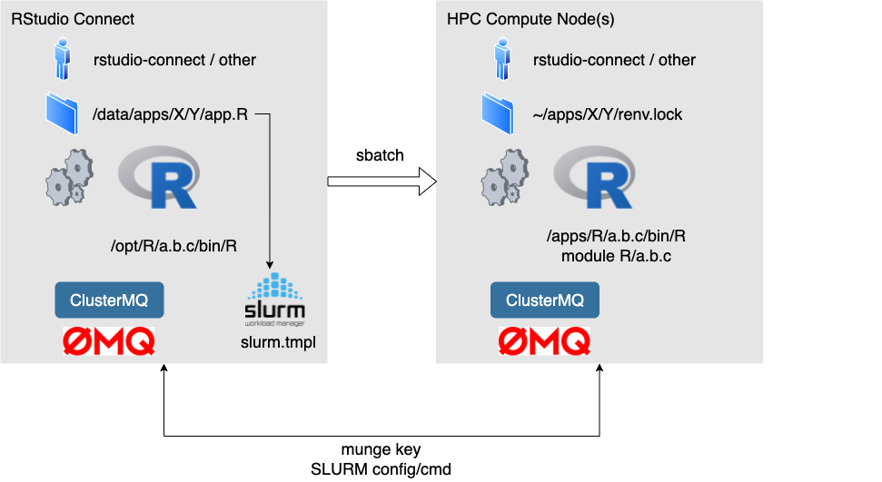
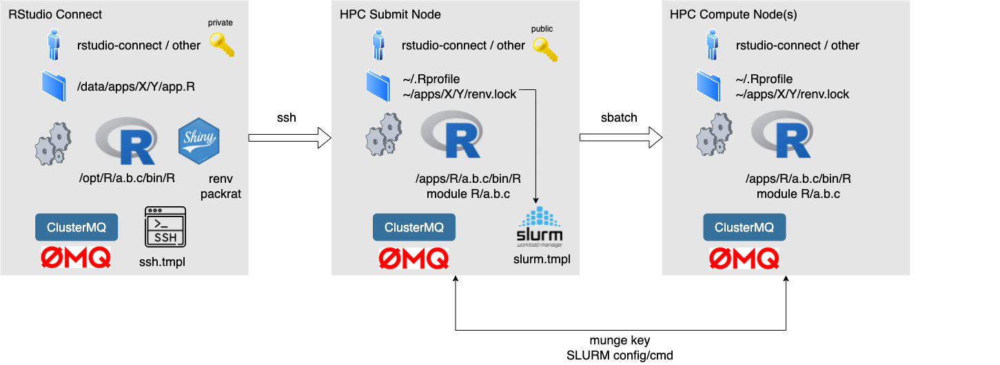

# penguins-hpc

This is a shiny app that demonstrates a possible way to interface a shiny app with an HPC cluster. The app can be deployed on a shiny server or on RStudio Connect. The idea is to use the compute power of the HPC in order to keep the interactivity of the app reasonable despite the need for complex and large scale computations.

## Design Goals

Various options exist to connect a shiny app to the HPC exist. Any such option will trigger different implementations. Those options range from very tight to a very loose integration with various magnitude of changes on the shiny and HPC infrastructure.

## R packages used to interface with an HPC cluster

There is many R packages available for High Performance Computing (HPC) . The secion "Resource Managers and batch schedulers" on the [HPC task view on CRAN](https://cran.r-project.org/web/views/HighPerformanceComputing.html) is particularly helpful for the work presented here. We are picking two packages here: 
 
* [`clustermq`](https://mschubert.github.io/clustermq/) - remnotely run gneric R code on a HPC cluster using the [zeromq](https://zeromq.org/) framework.
* [`batchtools`](https://mllg.github.io/batchtools/) - Map Reduce in R

## Pro & Contra for both packages

|    | clustermq |     batchtools          |
|----------|:-------------|:------|
| Pro |  <ul><li>runs in memory - very fast and extremely scalable</li><li>generic scheduling of R functions as well as loops</li><li>can run any parXapply functions against the clustermq parallel backend</ul> |  <ul><li>No OS dependencies</li><li>use of transient disk space for job registry allows to selectively re-run failed tasks</li></ul> |
| Contra | <ul><li>depends on zeromq (OS package)</li><li>since everything runs in-memory, a failed/errored partial task is difficult to re-run </li></ul>| <ul><li>use of transient disk space for job registry creates significant overhead when it comes to scalability</li><li>slower than clustermq for short tasks</li><li>designed for Map Reduce calls</li></ul> |

For the following, we will focus on `clustermq` as a package of choice. 

## Connecting a shiny app on RStudio Connect with an HPC using clustermq

Please note that the below always refers to SLURM - any other clustermq supported scheduler/resource manager (e.g. LSF, SGE, PBS/Torque) will work the same. 

### Option 1: Make the RStudio Connect Environment a submit node 

* The `zeromq` package (part of the operating system) must be installed on both the Connect server as well on the compute nodes
* The RStudio Connect Server needs to be a submit node, i.e. it needs to share the SLURM config, binaries and the munge.key
* The user running the app on rstudio-connect and on the Compute nodes ideally should be the same. Most likely this will be a service account. 
* The SLURM configuration must be done within `app.R` (e.g. `clustermq.scheduler` and (optionally `clustermq.template` if the default template is good enough) 
* R versions on Connect and the HPC should match
* Updates to the clustermq template (`slurm.tmpl` in the case of SLURM) are needed 
   * if app uses `renv` and the compute functions use more than just the recommended packages. In this case it is advisable to deploy a copy of `renv.lock` in an application specific folder in the user's home-directory and configure the respective folder and activation of the environment within the template  
   * if HPC cluster uses software environment modules

### Option 2: Connect RStudio Connect via ssh to the HPC cluster 

* The `zeromq` package (part of the operating system) must be installed on both the Connect server as well on the submit & compute nodes of the HPC
* The RStudio Connect Server needs to store the private ssh key of the user running the app while the public ssh key is stored on the HPC in the user's home. ssh keys must be passwordless
* The user running the app on rstudio-connect and on the HPC ideally should be the same. Most likely this will be a service account. 
* The SSH configuration must be done within `app.R` (e.g. `clustermq.scheduler` and (optionally `clustermq.template` if the default template is good enough)
* The SLURM configuration can be done in `.Rprofile` 
* R versions on Connect and the HPC should match
* Updates to the clustermq templates (`slurm.tmpl` in the case of SLURM and `ssh.tmpl`) are needed 
   * if app uses `renv` and the compute functions use more than just the recommended packages. In this case it is advisable to deploy a copy of `renv.lock` in an application specific folder in the user's home-directory and configure the respective folder and activation of the environment within the template  
   * if HPC cluster uses software environment modules

### Comparison of both options

|    | Option 1: Connect as HPC submit node |     Option 2: Connect separate from HPC          |
|----------|:-------------|:------|
| Pro |  <ul><li>more direct integration</li><li>faster start of the computation</li><li>no need for ssh keys</li></ul> |  <ul><li>No need to extend the HPC to RStudio Connect - keep both infrastructures separate</li></ul> |
| Contra | <ul><li>Extension of HPC into Connect environment creates additional complexity within Connect</li></ul>| <ul><li>Configuration of two clustermq interfaces: `ssh.tmpl` and `slurm.tmpl`</li><li>additional complexity when troubleshooting</li><li>startup time of computation longer</li></ul> |
